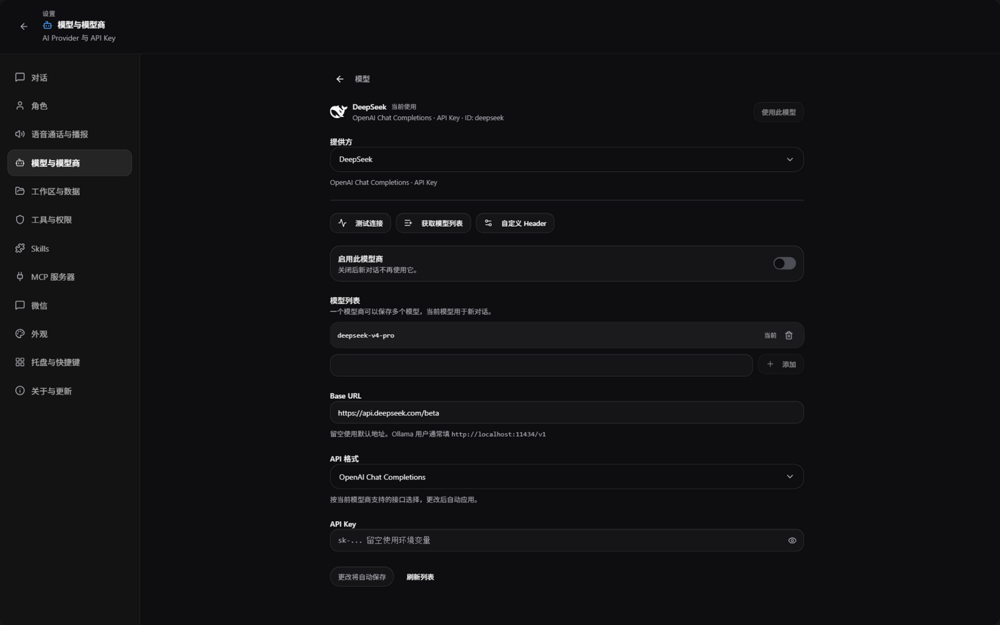
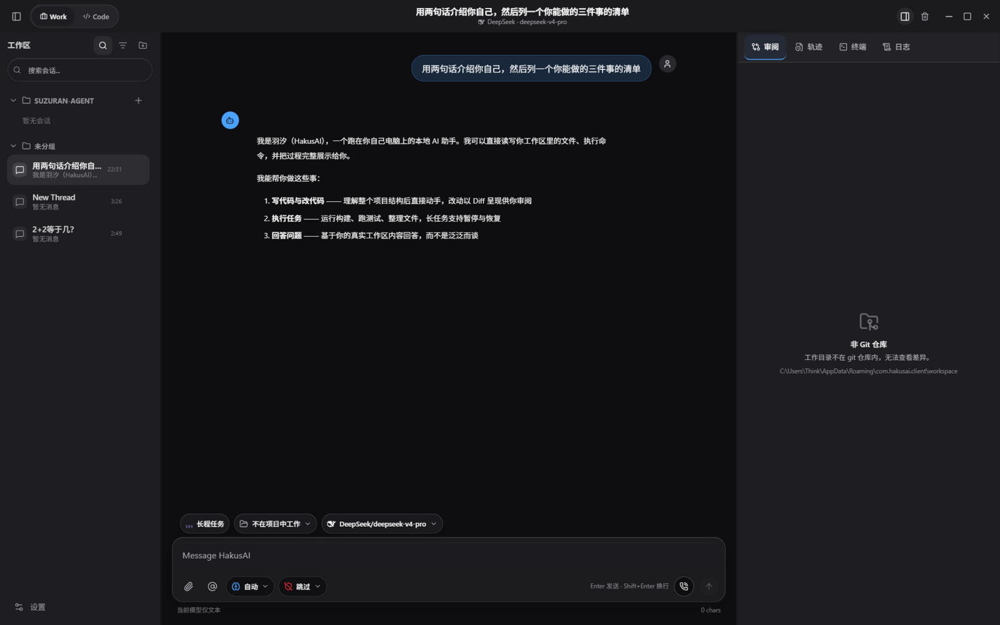

<div align="center">


# HakusAI

**跑在你自己电脑上的 AI 工作台** —— 桌面图形界面 + 终端，多模型接入，文件与命令工具，
项目工作区、MCP、会话持久化、语音、自定义 Skills。你的代码与数据始终留在本机。

[](https://github.com/modemneko/HakusAgent/releases/latest)
[](https://github.com/modemneko/HakusAgent/actions/workflows/build-all.yml)
[](#产品形态)

</div>

---

## 界面一览

**对话主界面** —— 会话按工作区分组管理，右侧工作台提供 Diff 审阅、运行轨迹、终端与日志：


**模型与模型商** —— 多模型多 Key 管理，改动自动保存，无需手动点按钮：



**液态玻璃下拉** —— 全部下拉/展开列表统一圆角玻璃质感：


**紧凑侧栏** —— 收起后只保留核心动作，一键回到完整会话列表：



## 核心特性

- **多模型接入** —— DeepSeek、OpenAI、Anthropic、Ollama 等内置目录，以及任意
  OpenAI 兼容的自定义模型商；每个模型商可保存多个模型，切换即时生效
- **项目工作区** —— AI 的读写与命令被约束在项目目录内；改动以 Diff 呈现，审阅后采纳
- **Diff 审阅工作台** —— 逐文件查看改动、暂存/丢弃，配合轨迹、终端、日志四合一侧栏
- **会话持久化** —— 会话历史落库，按工作区分组，支持搜索、置顶、重命名、回撤
- **长程任务** —— 复杂任务拆解执行，支持暂停、恢复与进度展示
- **语音对话** —— 语音输入、识别与播报，支持打断
- **自动更新** —— 内置更新器，有新版本时设置入口亮起绿色提示点
- **本地优先** —— 配置、会话、凭据保存在本机，不上传任何服务器
- **自定义 Skills** —— 在设置中安装管理，输入 `@` 即可调用

## 下载安装

从 [Releases](https://github.com/modemneko/HakusAgent/releases/latest) 下载对应平台的安装包：

| 平台 | 文件 |
| --- | --- |
| Windows x64 | `HakusAI_0.3.0_x64-setup.exe` |

安装向导支持中文/英文，完成后可选**开机自动启动**。应用内置更新器：
有新版本时设置入口旁会出现绿色圆点，在 **设置 → 关于与更新** 中一键升级。

> 首次启动会进入初始化向导：选择语言 → 选择模型商 → 填入 API Key → 选择默认模型。

## 从源码构建

### 桌面端（主界面）

```powershell
cd HakusAgent/frontend/desktop-tauri
npm ci
npm run tauri:dev        # 开发
npm run tauri:build      # 构建 Windows 安装包
```

### Python 核心与后台

```powershell
python -m venv .venv
.\.venv\Scripts\Activate.ps1
pip install -e ".[server]"
python -m hakusai_server.server
```

### Rust CLI

```powershell
cd frontend/terminal
cargo build --release --bin hakuscli
.\target\release\hakuscli.exe
```

模型与 API Key 配置见 `config.example.yaml` 和
[`frontend/terminal/config.example.toml`](frontend/terminal/config.example.toml)。

## 产品形态

| 入口 | 主要实现 | 位置 | 状态 |
| --- | --- | --- | --- |
| HakusAI 桌面端 | Tauri 2 + React + TypeScript | `HakusAgent/frontend/desktop-tauri/` | 主桌面界面 |
| 桌面后台 | Python + FastAPI + AgentCore | `src/hakusai_server/`、`hakus/` | Windows/macOS/Linux 桌面端使用 |
| Android 后台 | Rust Runtime API | `frontend/terminal/crates/tui/` | 由 Tauri 进程内嵌 |
| HakusCLI | Rust + ratatui | `frontend/terminal/` | 主终端客户端 |
| Python CLI | Python + Textual | `hakus/cli/` | 兼容入口 |

`webui/` 和 `editor/` 是旧界面/实验工具，不是当前 Tauri 桌面端的开发入口。

## 文档

- [文档索引](docs/README.md)
- [项目使用总览](docs/PROJECT_OVERVIEW.md)
- [架构说明](docs/ARCHITECTURE.md)
- [开发指南](docs/DEVELOPMENT.md)
- [Skills 管理与调用](docs/SKILLS.md)
- [安装指南](docs/INSTALL.md)

## Skills 策略

仓库不再内置大体积工作区 Skills 集合。用户可以在桌面端的
**设置 > Skills** 中安装和管理，也可以把 Skill 放到项目或用户目录。聊天输入框中输入
`@` 可选择已启用的 Skill。详见 [Skills 文档](docs/SKILLS.md)。

## 验证

```powershell
python -m pytest tests/test_desktop_skills.py -q
cd HakusAgent/frontend/desktop-tauri
npm run build
```

完整测试矩阵和发布约束见 [开发指南](docs/DEVELOPMENT.md)。

---

<div align="center">

**HAKUSAI 26** · CylonX Intelligents

</div>
